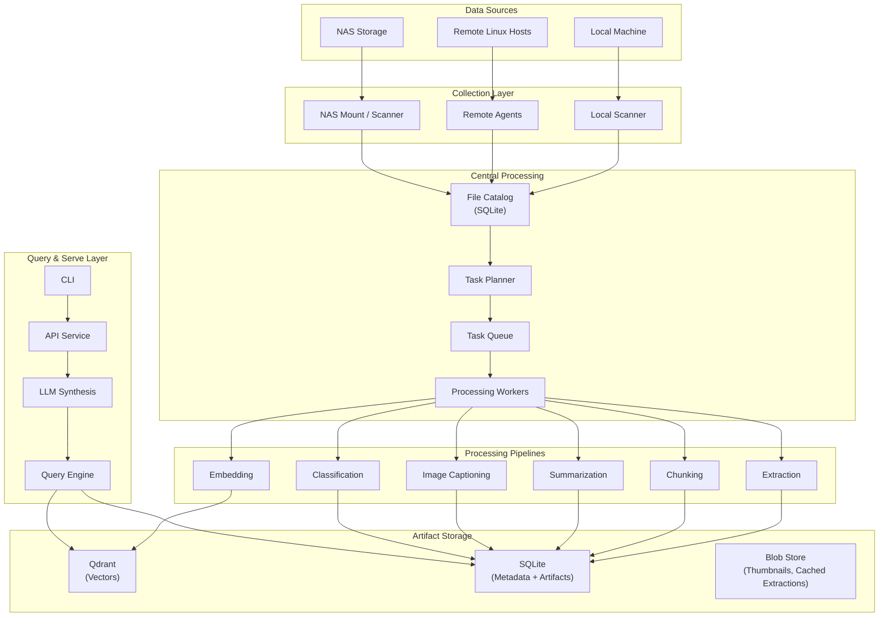
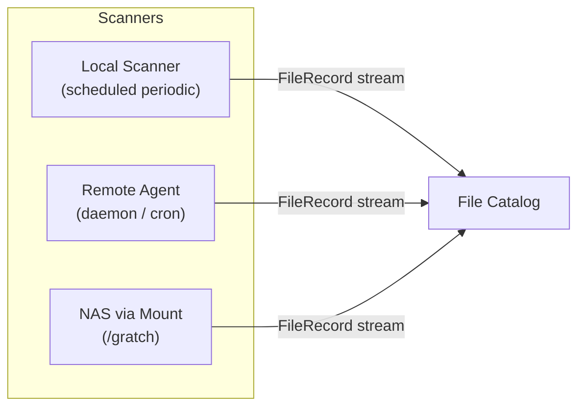
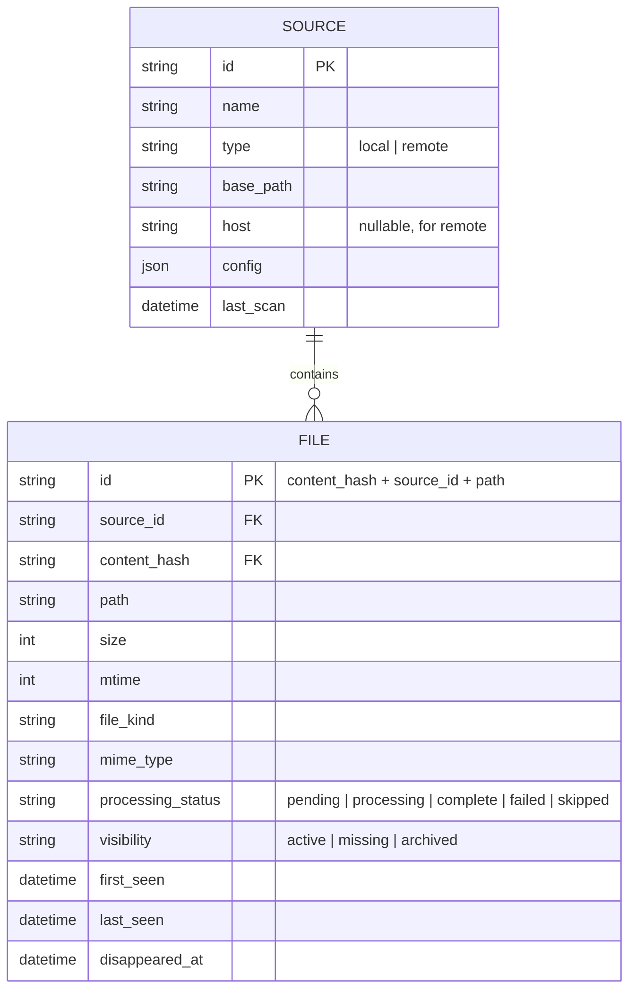
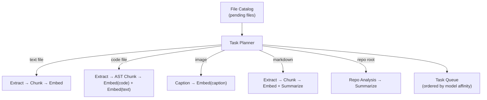
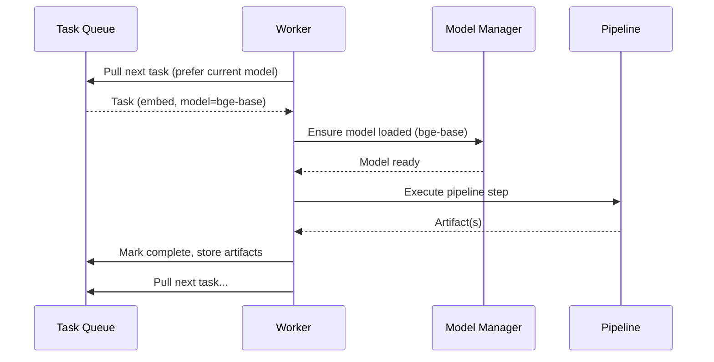
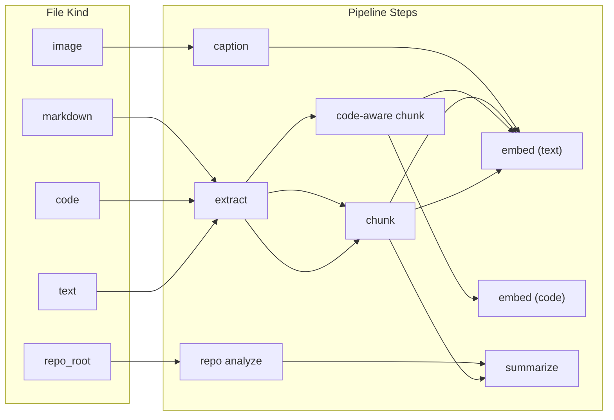
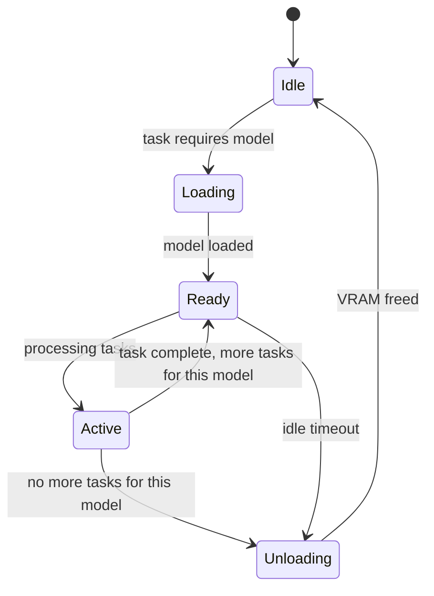
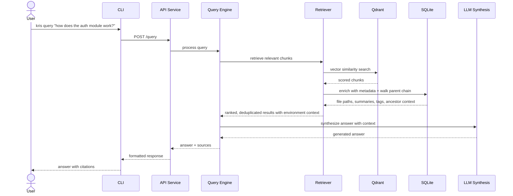
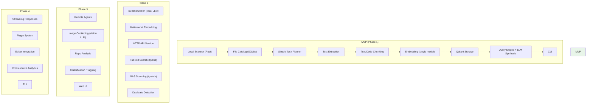

# kris — Personal Data Intelligence System

## System Overview

kris is a personal data intelligence platform for indexing, analyzing, and querying data across heterogeneous sources: local machines, remote Linux hosts, and NAS devices. It combines full-text indexing, semantic search, and multi-LLM analysis into a unified system with a distributed collection model.

The system is designed as a **hub-and-spoke architecture** where lightweight agents on remote sources feed a central processing and query engine. kris is the successor to [krag](../krag), incorporating lessons learned and expanding scope from project-scoped RAG to cross-source personal intelligence.

The architecture prioritizes:

- **Incremental processing** — only new/changed files are processed
- **Modality-aware pipelines** — text, code, images, and structured data each have tailored processing paths
- **LLM efficiency** — batch work by model to minimize swap overhead
- **Interface-first design** — contracts between layers are stable; implementations evolve independently
- **Local-first operation** — no cloud dependencies; all processing on owned hardware; remote LLM APIs available as quality fallback only
- **Content-addressed dedup** — files with identical content share processing artifacts across sources
- **Nothing is lost** — metadata is always recorded, even for files too large to process; deleted files are archived, not purged

---

## High-Level Architecture



---

## Architectural Layers

### 1. Collection Layer

Responsible for discovering files and reporting their metadata to the central catalog. Each source type has an adapter tuned to its access pattern.



**Local Scanner (Rust)** — Walks configured directories on the host machine using periodic scheduled scans. Each configured path has its own scan priority/schedule (e.g., code directories scanned hourly, image directories weekly). Performs content hashing for change detection. No real-time filesystem watching — periodic scanning keeps complexity manageable and is sufficient for the expected change rate (~hundreds of files/day).

**Remote Agents (Rust)** — The same scanner binary deployed to remote Linux hosts, operating in agent mode. Runs as a daemon or via cron, scans locally, and pushes `FileRecord` manifests to the hub. Produces a single static binary for easy deployment. Future: Windows agent support via scheduled tasks.

**NAS Scanner** — The NAS is mounted as a local filesystem at `/gratch`. The local scanner handles NAS paths directly — no special NAS-specific scanner needed. NAS paths are configured with their own scan schedule (typically less frequent than local code paths).

#### FileRecord Schema

The foundational data unit flowing from collection into the catalog:

```
FileRecord {
    source_id:    String        // which source produced this (e.g., "nas-media", "dev-laptop")
    path:         String        // path relative to source root
    content_hash: String        // SHA-256 of file content
    size:         u64
    mtime:        u64           // last modification time (epoch seconds)
    file_kind:    FileKind      // text, code, image, audio, video, archive, repo_root, binary, unknown
    mime_type:    Option<String> // detected MIME type
    permissions:  u32           // unix permissions
}
```

---

### 2. File Catalog

A SQLite-based registry of every known file across all sources. This is the system's **source of truth** for what exists, what has changed, and what has been processed.



**Key behaviors:**
- Upserts on each scan — compares incoming `FileRecord` against stored state
- Marks files as `pending` when new or content_hash changes
- **Archive on disappearance**: Files not seen in the latest scan are marked `missing` with a timestamp. Artifacts (chunks, embeddings, summaries) are **never automatically deleted**. Cleanup is user-initiated via CLI selectors (path, regex, source, "all missing")
- **Metadata always recorded**: Even files that exceed size limits or are binary/unknown get a catalog entry. Processing may be skipped, but the file's existence, size, path, and kind are always tracked. Users can query for skipped files and force-queue them for specific processing pipelines.
- **Content-addressed dedup**: Files with identical `content_hash` across different sources share processing artifacts. The catalog tracks per-source file entries, but chunks/embeddings reference the content hash. This also enables duplicate detection as a user-facing feature.
- Provides queries for the task planner: "give me all pending files of kind X"

---

### 3. Task Planner

Examines the catalog for unprocessed or changed files and generates a set of tasks. The planner understands which processing steps apply to which file kinds and manages dependencies between tasks.



#### Task Schema

```
Task {
    id:           UUID
    content_hash: String        // FK to content (dedup key)
    task_type:    TaskType      // extract, chunk, embed, summarize, caption, classify, repo_analyze
    depends_on:   Vec<TaskId>   // tasks that must complete first
    status:       TaskStatus    // queued, running, complete, failed, skipped
    model_hint:   Option<String> // which model this task prefers
    priority:     u8            // 0 = highest
    attempts:     u8
    max_attempts: u8
    created_at:   datetime
    started_at:   Option<datetime>
    completed_at: Option<datetime>
    error:        Option<String>
}
```

**Task ordering strategy:**
1. Group tasks by `model_hint` to minimize LLM swaps
2. Within a model group, order by dependency (topological sort)
3. Within the same dependency level, order by priority then age

---

### 4. Processing Workers

Execute tasks from the queue. Workers are model-aware: they hold a reference to the currently loaded model and prefer to pull tasks that match, avoiding unnecessary model swaps.



#### Processing Pipelines

Each `TaskType` maps to a processing pipeline. Pipelines are composable and pluggable.

| TaskType | Input | Output | Model Required |
|----------|-------|--------|----------------|
| `extract` | File path | Raw text | None |
| `chunk` | Raw text + file metadata | Chunk records | None |
| `embed` | Chunks | Vectors | Embedding model |
| `summarize` | Text/chunks | Summary text | LLM |
| `caption` | Image path | Caption text | Vision LLM |
| `classify` | File metadata + content sample | Tags/categories | LLM or heuristic |
| `repo_analyze` | Repo root path | Repo summary | LLM + heuristics |

**File-kind to pipeline mapping:**



---

### 5. Model Management

Manages the lifecycle of embedding models and LLMs. Draws from krag's proven `LLMPool` pattern with extensions for the task-oriented workload.



**Key concepts:**
- **VRAM budget**: 16 GB available (NVIDIA 4090 Super). System tracks usage and only loads models that fit within budget (80% safety margin)
- **Model affinity**: Task queue sorts by model to maximize batch size per loaded model
- **Hot-swap**: When a different model is needed and VRAM is insufficient, the current model is unloaded first
- **Simultaneous mode**: With 16 GB VRAM, embedding models + a smaller LLM can often coexist. Larger LLMs require hot-swap.
- **Model registry**: Declarative configuration of available models with their VRAM requirements, capabilities, and per-model prompt templates
- **Local-first, remote-fallback**: All models default to local inference. Remote API backends (OpenAI-compatible) available per-model as a quality fallback when local models don't produce sufficient quality for a task (e.g., summarization). Configurable per task type.
- **Multi-model embedding**: Architecture supports N embedding models from the start. Each model is registered with its dimensions, VRAM footprint, and the file kinds it's suited for. MVP starts with one model; additional models (code-specific, etc.) added incrementally.

---

### 6. Artifact Storage

Processing outputs are stored in typed backends appropriate to their access patterns.

| Artifact Type | Storage | Rationale |
|---------------|---------|-----------|
| Vectors/embeddings | Qdrant | Purpose-built for vector similarity search |
| File metadata | SQLite | Relational queries, joins, aggregation |
| Chunk records | SQLite | Relational, linked to files |
| Summaries | SQLite | Queryable text, linked to files |
| Image captions | SQLite | Queryable text, linked to files |
| Classifications/tags | SQLite | Relational, filterable |
| Thumbnails | Filesystem (blob store) | Binary blobs, not queryable |
| Processing state | SQLite | Transactional consistency |

**Qdrant collection strategy:**
- Named vector spaces per embedding model (e.g., `text`, `code`)
- Payload includes: `content_hash`, `chunk_index`, `file_kind`
- File paths and source IDs resolved at query time by joining `content_hash` back to SQLite (ensures deduped content returns all associated paths)
- Enables filtered search (by file kind; source/path filtering via SQLite join)

---

### 7. Query & Serve Layer

Provides search and synthesis capabilities over the indexed data.



**Query modes** (inherited from krag, extended):
- **Semantic search**: Vector similarity against embedded chunks
- **Hybrid search**: Semantic + keyword/full-text (BM25 or SQLite FTS)
- **Cross-source search**: Search across all sources or filter by source
- **File-type scoped**: Limit search to code, docs, images, etc.
- **Temporal queries**: "What changed this week?" via catalog metadata
- **Multi-collection fusion**: Reciprocal Rank Fusion across vector spaces

**Environment context enrichment**: When chunks are retrieved, the query engine walks the `parent_content_hash` chain in the CONTENT table, collecting ancestor summaries. This hierarchical context (e.g., function → class → file → repo) is injected into the LLM prompt alongside the chunk content, giving the LLM structural awareness of where each piece of information fits.

---

## Cross-Cutting Concerns

### Configuration

XDG-compliant configuration following krag's established pattern:

| Location | Contents |
|----------|----------|
| `$XDG_CONFIG_HOME/kris/config.toml` | Sources, models, pipeline settings |
| `$XDG_CACHE_HOME/kris/` | Downloaded models, Qdrant data |
| `$XDG_STATE_HOME/kris/` | SQLite databases, logs, PID files |
| `$XDG_DATA_HOME/kris/` | Blob store (thumbnails, cached extractions) |

### Observability

- **Structured logging**: Rotating log files with configurable verbosity
- **Pipeline metrics**: Files processed, tasks completed/failed, duration per stage
- **Index statistics**: Total files, chunks, embeddings per source and collection
- **Health checks**: API endpoint for monitoring service status

### Error Handling & Resilience

- **Task retry**: Failed tasks retry with exponential backoff (configurable max attempts)
- **Poison pill isolation**: Files that consistently fail processing are marked `skipped` with error details
- **Partial progress**: Processing is checkpointed — interrupted runs resume from where they stopped
- **Graceful degradation**: If a model fails to load, tasks requiring it are deferred, not dropped

### Security

- **Local-only by default**: API binds to localhost
- **SSH transport**: Remote agent communication over SSH (no custom auth protocol)
- **File permissions**: Respects Unix permissions; does not index files the user cannot read
- **No credential storage**: SSH keys managed by the OS/ssh-agent

---

## Technology Stack

| Component | Technology | Rationale |
|-----------|-----------|-----------|
| Scanner / Agent | Rust | Performance for filesystem traversal, single static binary for remote agent deployment |
| Scanner ↔ Core IPC | SQLite | Both Rust and Python have battle-tested SQLite libraries; atomic, no serialization format to maintain |
| Task planner / Queue | Python | Tight integration with ML ecosystem; simpler than cross-language orchestration |
| Processing workers | Python | ML/LLM ecosystem (transformers, sentence-transformers, llama-cpp) |
| API service | Python (FastAPI) | Proven pattern from krag, async support |
| CLI | Python (Typer + Rich) | Proven pattern from krag |
| Vector store | Qdrant | Proven in krag, named vectors, filtered search |
| Metadata store | SQLite | Simple, reliable, no server process. Shared between Rust scanner and Python core. |
| Configuration | TOML | Proven in krag, human-readable |

**Repository structure:** Monorepo with clear directory separation between Rust (scanner/agent) and Python (core/processing/API/CLI) components. May split into separate repos in the future if warranted.

---

## MVP Scope

The MVP implements a vertical slice through the architecture — sufficient to provide real value while validating the design. Focus: local scanning, text/code indexing, knowledge base queries via CLI.



### MVP Delivers

- Scan local directories (including NAS mount paths), detect new/changed files
- Per-path scan schedules with configurable priority
- Extract and chunk text, code, and markdown files
- Embed chunks with a single embedding model
- Store vectors in Qdrant with file metadata
- Content-addressed dedup: identical files across paths share artifacts
- Metadata recorded for all files, including those skipped for processing
- Query via CLI with semantic search + LLM synthesis (knowledge base mode)
- Incremental re-indexing (only process changes)
- Archive-on-deletion: missing files preserved with cleanup tooling

### MVP Defers

- Remote agents (only local + NAS mount)
- Summarization, captioning, classification
- Multi-model embeddings (architecture supports it, MVP uses one)
- HTTP API / Web UI
- Plugin system
- Hybrid search (semantic + full-text)

---

## Evolution Path

The architecture is designed so each phase adds capability without modifying existing interfaces:

| Phase | Adds | Interface Impact |
|-------|------|-----------------|
| **1 (MVP)** | Local scan → chunk → embed → knowledge base search via CLI | Establishes all core interfaces |
| **2** | NAS paths, summaries, multi-model embedding, HTTP API, hybrid search, dedup detection | New task types, new query endpoint, new embedding models |
| **3** | Remote agents, image captioning (vision LLM POC), repo analysis, classification, Web UI | New source adapters, new pipelines, new consumer |
| **4** | Streaming, plugins, editor integration, TUI, cross-source analytics | Extension points, new consumers |

### Scan Schedule Strategy

Each configured source path has an independent scan schedule, allowing high-churn directories to be scanned frequently while stable archives are scanned rarely:

| Content Type | Example Path | Scan Frequency |
|-------------|-------------|----------------|
| Source code | `~/src/` | Hourly |
| Notes/Obsidian | `~/notes/` | Every 2 hours |
| Config | `~/.config/` | Daily |
| NAS documents | `/gratch/documents/` | Daily |
| NAS images | `/gratch/photos/` | Weekly |
| NAS media | `/gratch/media/` | Weekly |

The initial "day zero" full scan across all sources is expected to take several days to weeks given the scale (~1-2M files, ~8 TB addressable). After the initial scan, daily incremental processing with a couple-hour window is sufficient for the expected change rate.

---

## Relationship to krag

kris is the successor to krag — a "lessons learned and expand" next generation. It draws on krag's proven patterns while addressing its limitations. kris will eventually replace krag once it reaches feature parity and beyond.

| From krag | In kris |
|-----------|---------|
| `LLMPool` (hot-swap, VRAM management) | Model Manager |
| `TextChunker` (file-type-aware splitting) | Chunking pipeline |
| `EmbeddingOrchestrator` (multi-model) | Embedding pipeline |
| `QdrantVectorStore` (named vectors, filtered ops) | Vector storage |
| Plugin system (entry points, ABC) | Plugin system (future phase) |
| Collection routing (8-level precedence) | Task planner file-kind routing |
| Retrieval post-processing (RRF, dedup, boosting) | Query engine |
| `ConfigManager` (XDG, TOML, validation) | Configuration |
| CLI (Typer + Rich) | CLI |
| Service architecture (FastAPI, SSE) | API service |

**Key differences from krag:**
- Multi-source (not just local directories)
- Task graph with persistent state (not single-pass pipeline)
- Rust scanner (not Python filesystem walk)
- Image/multimodal support (not text-only)
- SQLite as primary metadata store (not JSON sidecar)
- Content-addressed dedup across sources
- Archive-oriented data retention (nothing auto-deleted)
- Designed for scheduled background processing (not purely on-demand CLI invocation)
- Local-first with remote LLM fallback (not local-only)
- Multi-model embedding from the start (architecture-level, not bolted on)
