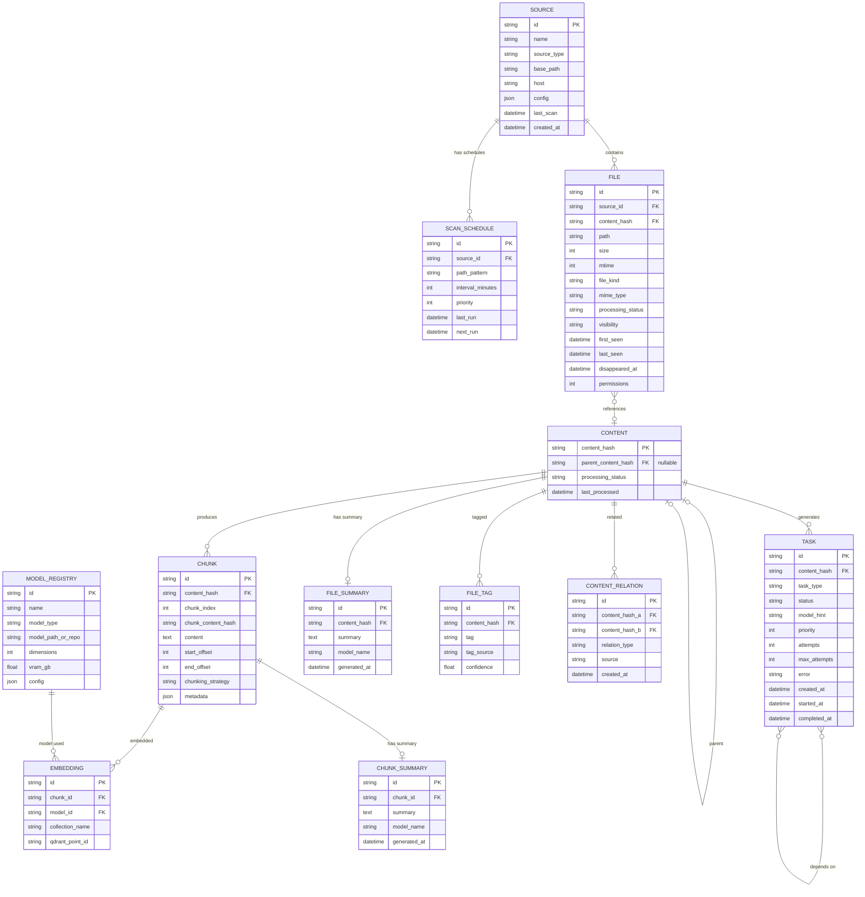
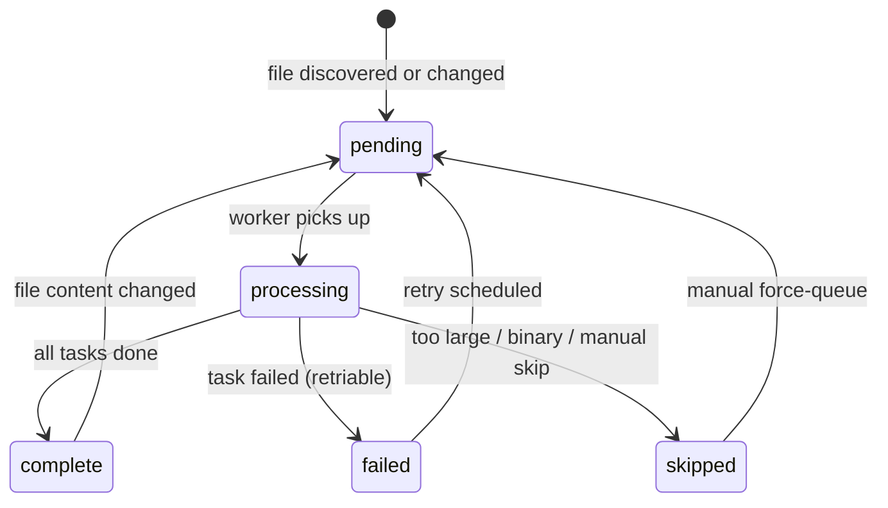
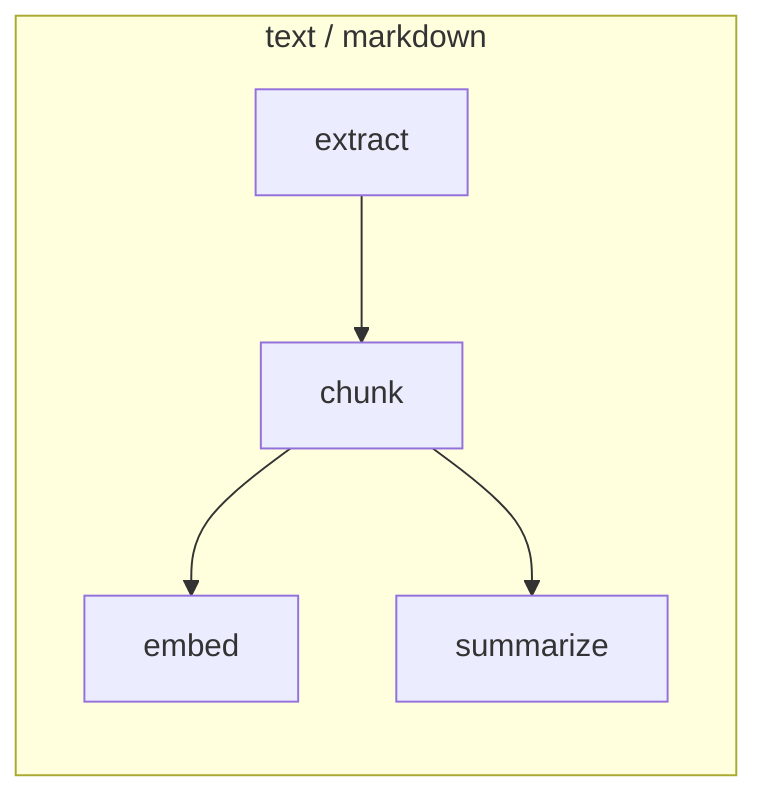
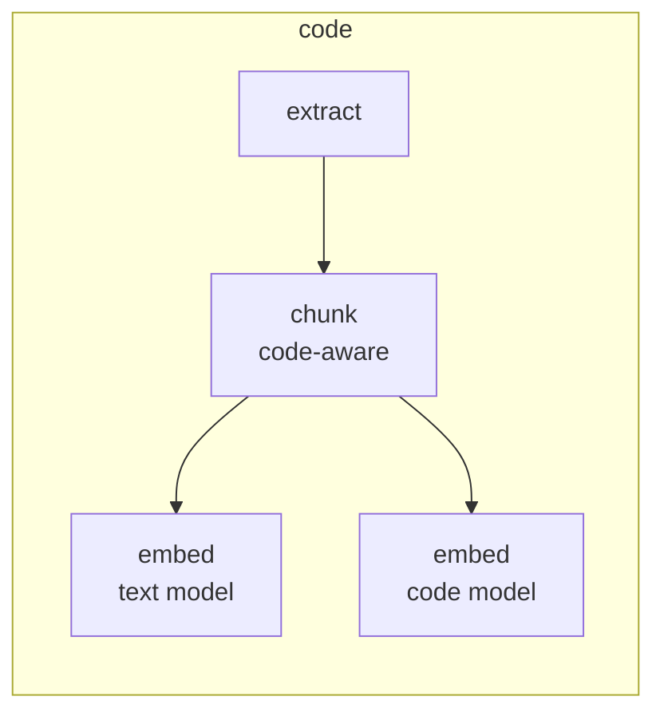
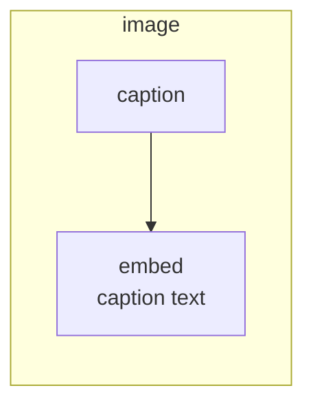
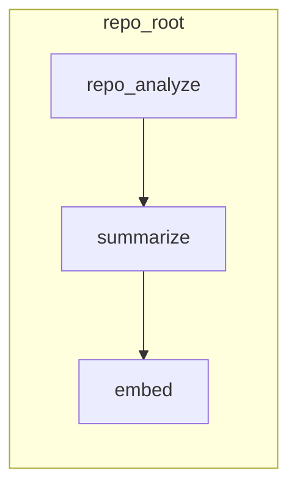

# kris — Core Data Model

This document defines the canonical schemas and contracts between system components. These are the interfaces that must remain stable as implementations evolve.

---

## Entity Relationship Overview



### Content-Addressed Dedup Model

The data model separates **file identity** (where a file lives) from **file content** (what the file contains). The `FILE` table tracks per-source-path entries. The `CONTENT` table is keyed by `content_hash` and owns all processing artifacts (chunks, embeddings, summaries, tags). When the same content exists in multiple locations, only one set of processing artifacts is created.

This design also enables **duplicate detection**: querying for content_hash values that appear in multiple FILE rows surfaces duplicates across sources for user review and cleanup.

### Environment Context Chain

Content entries form a hierarchical **context chain** via the nullable `parent_content_hash` FK. This records structural containment relationships:

```
function → class → file → component → project/repo
```

When a chunk is retrieved during a query, the system can walk up the parent chain, collecting ancestor summaries to inject as context for the LLM. For example, a retrieved function chunk can be enriched with: "this function is in `KragClient`, which is part of the krag CLI, which is part of the krag project."

**For code**, the hierarchy is structural and can be inferred automatically during processing (AST analysis, directory structure, `.git` detection).

**For non-code content**, the parent relationship can represent directory-inferred grouping (e.g., all images in `photos/2025-portland-vice/` share a parent) or user-assigned grouping. This area is expected to evolve — the schema accommodates it without requiring it.

Additional non-hierarchical relationships between content are captured in the `CONTENT_RELATION` table (see below).

---

## Source

Represents a configured data source — a location from which files are discovered.

| Field | Type | Description |
|-------|------|-------------|
| `id` | `TEXT PK` | Stable identifier (e.g., `local-src`, `nas-documents`, `dev-server`) |
| `name` | `TEXT` | Human-readable display name |
| `source_type` | `TEXT` | `local`, `remote` — NAS mounts are `local` since they appear as mounted filesystems |
| `base_path` | `TEXT` | Root directory to scan on the source |
| `host` | `TEXT NULL` | Hostname/IP for remote sources |
| `config` | `JSON` | Source-specific settings (excludes, scan interval, SSH key path, etc.) |
| `last_scan` | `DATETIME` | Timestamp of last completed scan |
| `created_at` | `DATETIME` | When this source was registered |

### Source Config Examples

**Local source with scan schedules:**
```toml
[sources.local-src]
name = "Source Code"
type = "local"
base_path = "~/src"
exclude_patterns = ["target", "node_modules", ".git", ".venv"]

[[sources.local-src.schedules]]
path_pattern = "**"
interval_minutes = 60       # code scanned hourly
priority = 1
```

**Remote source (agent mode):**
```toml
[sources.dev-server]
name = "Dev Server"
type = "remote"
base_path = "/home/ken/projects"
host = "devbox.local"
agent_mode = true            # runs as daemon or via cron
ssh_key = "~/.ssh/id_ed25519"
exclude_patterns = ["target", "node_modules", ".git"]

[[sources.dev-server.schedules]]
path_pattern = "**"
interval_minutes = 120
priority = 2
```

**NAS source (mounted filesystem):**
```toml
[sources.nas-documents]
name = "NAS Documents"
type = "local"               # NAS is a local mount, not a special type
base_path = "/gratch/documents"
exclude_patterns = ["@eaDir", ".DS_Store"]

[[sources.nas-documents.schedules]]
path_pattern = "**"
interval_minutes = 1440      # daily
priority = 3

[sources.nas-photos]
name = "NAS Photos"
type = "local"
base_path = "/gratch/photos"
exclude_patterns = ["@eaDir", ".DS_Store", "Thumbs.db"]

[[sources.nas-photos.schedules]]
path_pattern = "**"
interval_minutes = 10080     # weekly
priority = 5
```

---

## File

The catalog entry for a discovered file. One record per unique (source_id, path) pair. The file table tracks **location** while the content table tracks **substance**.

| Field | Type | Description |
|-------|------|-------------|
| `id` | `TEXT PK` | Deterministic ID: `sha256(source_id + ":" + path)` |
| `source_id` | `TEXT FK` | Which source this file belongs to |
| `path` | `TEXT` | Path relative to source's `base_path` |
| `content_hash` | `TEXT FK` | SHA-256 of file content → links to CONTENT table |
| `size` | `INTEGER` | File size in bytes |
| `mtime` | `INTEGER` | Last modification time (Unix epoch) |
| `file_kind` | `TEXT` | Gross classification (see FileKind enum) |
| `mime_type` | `TEXT NULL` | Detected MIME type |
| `processing_status` | `TEXT` | Current processing state |
| `visibility` | `TEXT` | `active`, `missing`, `archived` |
| `first_seen` | `DATETIME` | When the file was first discovered |
| `last_seen` | `DATETIME` | When the file was last confirmed to exist |
| `disappeared_at` | `DATETIME NULL` | When the file was first not seen (NULL = still present) |
| `permissions` | `INTEGER` | Unix file permissions |

**Note:** Metadata is always recorded for every file the scanner encounters, regardless of whether the file will be processed. Files exceeding size limits or with unprocessable kinds still get a catalog entry with `processing_status = 'skipped'`. Users can query for skipped files and force-queue specific pipelines via CLI.

### FileKind Enum

```
text        — Plain text, documents, notes
code        — Source code (detected by extension + heuristics)
markdown    — Markdown files (distinct because of dual text/code nature)
image       — JPEG, PNG, SVG, WebP, etc.
audio       — MP3, FLAC, WAV, etc.
video       — MP4, MKV, etc.
archive     — ZIP, tar.gz, etc.
repo_root   — Directory containing .git (virtual file kind for repo-level analysis)
config      — Configuration files (TOML, YAML, JSON, INI, etc.)
data        — Structured data (CSV, TSV, Parquet, etc.)
binary      — Known binary format not otherwise classified
unknown     — Cannot determine
```

### ProcessingStatus Enum



| Status | Description |
|--------|-------------|
| `pending` | Needs processing (new or content changed) |
| `processing` | Currently being processed |
| `complete` | All applicable tasks completed successfully |
| `failed` | Processing failed, may be retried |
| `skipped` | Not processed (binary, too large, etc.) — can be force-queued for specific pipelines |

### Visibility Enum

Tracks whether the file still exists on its source. Files are **never automatically deleted** from the catalog or artifact storage.

| Status | Description |
|--------|-------------|
| `active` | File exists and was seen in the latest scan |
| `missing` | File was not seen in the latest scan (disappeared_at is set) |
| `archived` | User confirmed the file is gone but wants to keep artifacts |

Cleanup of missing/archived files and their artifacts is user-initiated via CLI selectors:
- By path or path regex
- By source
- By visibility status
- "All missing older than N days"

---

## Content

Represents the substance of a file, keyed by content hash. Owns all processing artifacts. The `parent_content_hash` FK enables a hierarchical context chain (see [Environment Context Chain](#environment-context-chain)).

| Field | Type | Description |
|-------|------|-------------|
| `content_hash` | `TEXT PK` | SHA-256 of file content |
| `parent_content_hash` | `TEXT FK NULL` | Parent content in the hierarchy (e.g., file → repo). NULL for top-level or unlinked content. |
| `processing_status` | `TEXT` | `pending`, `processing`, `complete`, `failed`, `skipped` |
| `last_processed` | `DATETIME NULL` | When processing last completed |

**Parent chain examples:**

| Content | Parent | How determined |
|---------|--------|---------------|
| Function chunk | File content | AST analysis during code-aware chunking |
| Source file | Repo root | `.git` detection during scanning |
| Image | Directory/event | Directory structure or user assignment |
| Repo root | (none) | Top-level, no parent |
| Standalone note | (none) | Top-level, no parent |

---

## Content Relation

Captures non-hierarchical relationships between content entries. Unlike the single-parent chain, content can have many relations of various types.

| Field | Type | Description |
|-------|------|-------------|
| `id` | `TEXT PK` | UUID |
| `content_hash_a` | `TEXT FK` | First content in the relation |
| `content_hash_b` | `TEXT FK` | Second content in the relation |
| `relation_type` | `TEXT` | Type of relationship |
| `source` | `TEXT` | How the relation was established |
| `created_at` | `DATETIME` | When the relation was recorded |

### Relation Types

| Type | Description | Example |
|------|-------------|---------|
| `sibling` | Same logical group | Two files in the same module |
| `see-also` | Topically related | A README and its subject code |
| `derived-from` | One content produced from another | Generated code from a template |
| `imports` | Code dependency | File A imports/uses file B |

### Relation Source

| Source | Description |
|--------|-------------|
| `heuristic` | Inferred from directory structure, naming conventions |
| `llm` | Inferred by LLM during classification/analysis |
| `manual` | User-assigned via CLI |
| `ast` | Inferred from code analysis (imports, references) |

---

## Task

A unit of work to be performed on a content. Tasks form a DAG per content hash.

| Field | Type | Description |
|-------|------|-------------|
| `id` | `TEXT PK` | UUID |
| `content_hash` | `TEXT FK` | Target content |
| `task_type` | `TEXT` | What to do (see TaskType enum) |
| `status` | `TEXT` | `queued`, `running`, `complete`, `failed`, `skipped` |
| `model_hint` | `TEXT NULL` | Preferred model for this task |
| `priority` | `INTEGER` | Lower = higher priority (default: 100) |
| `depends_on` | `JSON` | Array of task IDs that must complete first |
| `attempts` | `INTEGER` | Number of attempts so far |
| `max_attempts` | `INTEGER` | Maximum retry count (default: 3) |
| `error` | `TEXT NULL` | Last error message |
| `created_at` | `DATETIME` | When the task was created |
| `started_at` | `DATETIME NULL` | When execution began |
| `completed_at` | `DATETIME NULL` | When execution finished |

### TaskType Enum

| Type | Description | Requires Model |
|------|-------------|----------------|
| `extract` | Extract raw text from file | No |
| `chunk` | Split text into chunks | No |
| `embed` | Generate vector embeddings from chunks | Embedding model |
| `summarize` | Generate a summary of file or chunk content | LLM |
| `caption` | Generate text description of an image | Vision LLM |
| `classify` | Assign tags/categories to a file | LLM or heuristic |
| `repo_analyze` | Analyze a repository's structure and purpose | LLM + heuristics |

### Task DAGs by File Kind









---

## Chunk

A semantically meaningful segment of a content's text.

| Field | Type | Description |
|-------|------|-------------|
| `id` | `TEXT PK` | `sha256(content_hash + ":" + chunk_index)` |
| `content_hash` | `TEXT FK` | Parent content |
| `chunk_index` | `INTEGER` | Ordinal position within the content |
| `chunk_content_hash` | `TEXT` | SHA-256 of chunk text (for chunk-level dedup) |
| `content` | `TEXT` | The actual chunk text |
| `start_offset` | `INTEGER` | Byte offset in original file |
| `end_offset` | `INTEGER` | Byte offset end |
| `chunking_strategy` | `TEXT` | Which strategy produced this chunk |
| `metadata` | `JSON` | Strategy-specific metadata (e.g., function_name, class_name, heading) |

The `metadata` JSON field stores structural context extracted during chunking. For code, this includes AST-derived identifiers (`function_name`, `class_name`, `module_name`) that inform the environment context chain. During retrieval, this metadata plus the parent chain on CONTENT provides the full hierarchical context for a chunk.

---

## Embedding

Tracks the relationship between chunks and their vector representations in Qdrant.

| Field | Type | Description |
|-------|------|-------------|
| `id` | `TEXT PK` | UUID |
| `chunk_id` | `TEXT FK` | Source chunk |
| `model_id` | `TEXT FK` | Which embedding model (FK to MODEL_REGISTRY) |
| `collection_name` | `TEXT` | Qdrant collection name |
| `qdrant_point_id` | `TEXT` | Point ID in Qdrant |

The actual vector data lives in Qdrant. This table provides the linkage back to the relational model for metadata enrichment during retrieval.

---

## Model Registry

Declarative catalog of all models available to the system. Configurable via TOML.

| Field | Type | Description |
|-------|------|-------------|
| `id` | `TEXT PK` | Stable identifier (e.g., `bge-base`, `jina-code`, `qwen2.5-7b`) |
| `name` | `TEXT` | Human-readable name |
| `model_type` | `TEXT` | `embedding`, `llm`, `vision` |
| `model_path_or_repo` | `TEXT` | Local path (GGUF) or HuggingFace repo ID |
| `dimensions` | `INTEGER NULL` | Vector dimensions (embedding models only) |
| `vram_gb` | `REAL` | Estimated VRAM usage in GB |
| `config` | `JSON` | Model-specific settings (prompt template, quantization, temperature, etc.) |
| `backend` | `TEXT` | `local`, `remote` — where inference runs |
| `api_base` | `TEXT NULL` | API base URL (remote models only) |
| `file_kinds` | `JSON NULL` | Which file kinds this model is suited for (embedding models) |

**Multi-model embedding strategy:** Each embedding model declares which file kinds it's best suited for. The task planner generates embed tasks with the appropriate `model_hint` based on file kind. MVP uses a single embedding model for all content; additional models are registered and activated as needed.

**Local vs. remote:** Models default to `backend = "local"`. Remote API backends can be configured per model as a quality fallback. The system always prefers local inference; remote is used only when local quality is insufficient for a specific task type (e.g., summarization).

### Model Configuration Example

```toml
[[models]]
id = "bge-base"
name = "BGE Base EN v1.5"
type = "embedding"
repo = "BAAI/bge-base-en-v1.5"
dimensions = 768
vram_gb = 0.5
file_kinds = ["text", "markdown", "config", "data"]

[[models]]
id = "jina-code"
name = "Jina Code Embeddings v2"
type = "embedding"
repo = "jinaai/jina-embeddings-v2-base-code"
dimensions = 768
vram_gb = 0.6
file_kinds = ["code"]

[[models]]
id = "qwen2.5-7b"
name = "Qwen 2.5 7B"
type = "llm"
path = "~/.cache/kris/models/qwen2.5-7b-instruct-q5_k_m.gguf"
vram_gb = 6.0
backend = "local"

[models.config]
temperature = 0.2
max_tokens = 512
prompt_template = "default"

[[models]]
id = "openai-gpt4o"
name = "GPT-4o (remote fallback)"
type = "llm"
backend = "remote"
api_base = "https://api.openai.com/v1"

[models.config]
temperature = 0.2
max_tokens = 512
```

---

## Artifact Tables

### File Summary

| Field | Type | Description |
|-------|------|-------------|
| `id` | `TEXT PK` | UUID |
| `content_hash` | `TEXT FK` | Summarized content |
| `summary` | `TEXT` | Generated summary text |
| `model_name` | `TEXT` | Which LLM generated this |
| `generated_at` | `DATETIME` | When the summary was created |

### File Tag

| Field | Type | Description |
|-------|------|-------------|
| `id` | `TEXT PK` | UUID |
| `content_hash` | `TEXT FK` | Tagged content |
| `tag` | `TEXT` | Tag value (e.g., "authentication", "infrastructure", "personal") |
| `tag_source` | `TEXT` | `heuristic`, `llm`, `manual` |
| `confidence` | `REAL` | 0.0–1.0 confidence score |

---

## Qdrant Payload Schema

Each point stored in Qdrant carries a payload for filtered search:

```json
{
    "content_hash": "abc123...",
    "source_id": "local-src",
    "path": "kris/src/main.rs",
    "file_kind": "code",
    "chunk_index": 3,
    "function_name": "process_file",
    "class_name": null,
    "heading": null,
    "tags": ["rust", "processing"],
    "parent_content_hash": "def789..."
}
```

**Indexed payload fields** (for filtered search):
- `content_hash` — join back to catalog for dedup-aware queries
- `parent_content_hash` — walk up context chain for retrieval enrichment
- `source_id` — filter by data source
- `file_kind` — filter by file type
- `path` — prefix filter for directory scoping
- `tags` — keyword filter
- `function_name`, `class_name` — code-specific filters

---

## Configuration Schema

Top-level configuration structure:

```toml
[general]
log_level = "info"          # debug, info, warning, error

# Sources are defined individually — see Source Config Examples above
# [sources.local-src]
# [sources.nas-documents]
# etc.

[scanner]
hash_algorithm = "sha256"
max_file_size_mb = 100      # Skip processing for files larger than this (metadata still recorded)
follow_symlinks = false
respect_gitignore = true

[chunking]
max_chunk_size = 1500       # tokens
overlap = 200               # tokens
code_aware = true

# Models are defined in [[models]] array — see Model Configuration Example above
# [[models]]
# id = "bge-base"
# ...

[model_defaults]
vram_budget_gb = 16.0       # NVIDIA 4090 Super
vram_safety_margin = 0.80
prefer_local = true         # always try local first; remote only as fallback

[storage]
qdrant_path = "$XDG_CACHE_HOME/kris/qdrant"
sqlite_path = "$XDG_STATE_HOME/kris/kris.db"
blob_path = "$XDG_DATA_HOME/kris/blobs"

[retention]
auto_delete = false         # never auto-delete artifacts for missing files
archive_missing = true      # mark missing files as archived, keep artifacts

[service]
host = "127.0.0.1"
port = 8741

[processing]
max_retries = 3
batch_size = 50             # files per planning cycle
worker_count = 1            # number of concurrent workers
mode = "cli"                # "cli" (on-demand) or "hybrid" (future: daemon + CLI)
```
