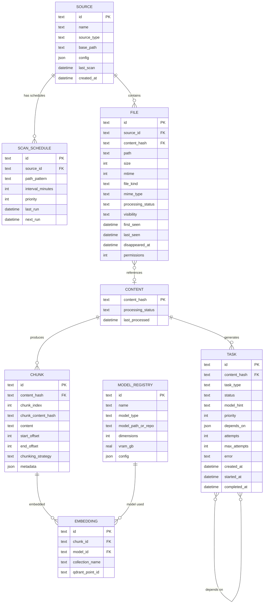

# Data Model: MVP Core

**Feature**: 001-mvp-core
**Source**: Extracted from [docs/data-model.md](../../docs/data-model.md) — MVP subset only

This document defines the MVP data model. It is a strict subset of the
full data model. Tables and fields marked "post-MVP" in the canonical
data model are omitted here.

---

## MVP Entity Relationship



## MVP Omissions

The following tables from the full data model are deferred to later
phases:

| Table | Reason | Phase |
|-------|--------|-------|
| `CONTENT_RELATION` | Non-hierarchical relations (imports, siblings) — not needed for MVP query | Phase 2+ |
| `FILE_SUMMARY` | Summarization pipeline deferred | Phase 2 |
| `CHUNK_SUMMARY` | Summarization pipeline deferred | Phase 2 |
| `FILE_TAG` | Classification pipeline deferred | Phase 2 |

The `CONTENT.parent_content_hash` field is also deferred. The MVP
creates flat content records without hierarchical context chains.
The column exists in the schema (nullable) for forward compatibility
but is not populated.

## MVP Task Types

Only these task types are active in the MVP:

| TaskType | Description | Model Required |
|----------|-------------|----------------|
| `extract` | Extract raw text from file | No |
| `chunk` | Split text into semantic chunks | No |
| `embed` | Generate vector embeddings | Embedding model |

Deferred: `summarize`, `caption`, `classify`, `repo_analyze`.

## SQLite Schema (MVP DDL)

```sql
CREATE TABLE source (
    id          TEXT PRIMARY KEY,
    name        TEXT NOT NULL,
    source_type TEXT NOT NULL DEFAULT 'local',
    base_path   TEXT NOT NULL,
    config      TEXT,  -- JSON
    last_scan   TEXT,  -- ISO 8601
    created_at  TEXT NOT NULL DEFAULT (datetime('now'))
);

CREATE TABLE scan_schedule (
    id               TEXT PRIMARY KEY,
    source_id        TEXT NOT NULL REFERENCES source(id),
    path_pattern     TEXT NOT NULL DEFAULT '**',
    interval_minutes INTEGER NOT NULL DEFAULT 60,
    priority         INTEGER NOT NULL DEFAULT 100,
    last_run         TEXT,
    next_run         TEXT
);

CREATE TABLE file (
    id                TEXT PRIMARY KEY,
    source_id         TEXT NOT NULL REFERENCES source(id),
    content_hash      TEXT NOT NULL,
    path              TEXT NOT NULL,
    size              INTEGER NOT NULL,
    mtime             INTEGER NOT NULL,
    file_kind         TEXT NOT NULL,
    mime_type         TEXT,
    processing_status TEXT NOT NULL DEFAULT 'pending',
    visibility        TEXT NOT NULL DEFAULT 'active',
    first_seen        TEXT NOT NULL DEFAULT (datetime('now')),
    last_seen         TEXT NOT NULL DEFAULT (datetime('now')),
    disappeared_at    TEXT,
    permissions       INTEGER,
    UNIQUE(source_id, path)
);

CREATE TABLE content (
    content_hash      TEXT PRIMARY KEY,
    parent_content_hash TEXT,  -- reserved for future use
    processing_status TEXT NOT NULL DEFAULT 'pending',
    last_processed    TEXT
);

CREATE TABLE task (
    id            TEXT PRIMARY KEY,
    content_hash  TEXT NOT NULL REFERENCES content(content_hash),
    task_type     TEXT NOT NULL,
    status        TEXT NOT NULL DEFAULT 'queued',
    model_hint    TEXT,
    priority      INTEGER NOT NULL DEFAULT 100,
    depends_on    TEXT,  -- JSON array of task IDs
    attempts      INTEGER NOT NULL DEFAULT 0,
    max_attempts  INTEGER NOT NULL DEFAULT 3,
    error         TEXT,
    created_at    TEXT NOT NULL DEFAULT (datetime('now')),
    started_at    TEXT,
    completed_at  TEXT
);

CREATE TABLE chunk (
    id                 TEXT PRIMARY KEY,
    content_hash       TEXT NOT NULL REFERENCES content(content_hash),
    chunk_index        INTEGER NOT NULL,
    chunk_content_hash TEXT NOT NULL,
    content            TEXT NOT NULL,
    start_offset       INTEGER NOT NULL,
    end_offset         INTEGER NOT NULL,
    chunking_strategy  TEXT NOT NULL,
    metadata           TEXT,  -- JSON
    UNIQUE(content_hash, chunk_index)
);

CREATE TABLE embedding (
    id              TEXT PRIMARY KEY,
    chunk_id        TEXT NOT NULL REFERENCES chunk(id),
    model_id        TEXT NOT NULL,
    collection_name TEXT NOT NULL,
    qdrant_point_id TEXT NOT NULL
);

CREATE TABLE model_registry (
    id                 TEXT PRIMARY KEY,
    name               TEXT NOT NULL,
    model_type         TEXT NOT NULL,
    model_path_or_repo TEXT NOT NULL,
    dimensions         INTEGER,
    vram_gb            REAL NOT NULL,
    config             TEXT  -- JSON
);

-- Indexes for common queries
CREATE INDEX idx_file_source ON file(source_id);
CREATE INDEX idx_file_content_hash ON file(content_hash);
CREATE INDEX idx_file_processing ON file(processing_status);
CREATE INDEX idx_file_visibility ON file(visibility);
CREATE INDEX idx_content_status ON content(processing_status);
CREATE INDEX idx_task_status ON task(status);
CREATE INDEX idx_task_content ON task(content_hash);
CREATE INDEX idx_chunk_content ON chunk(content_hash);
CREATE INDEX idx_embedding_chunk ON embedding(chunk_id);
CREATE INDEX idx_embedding_model ON embedding(model_id);
```
