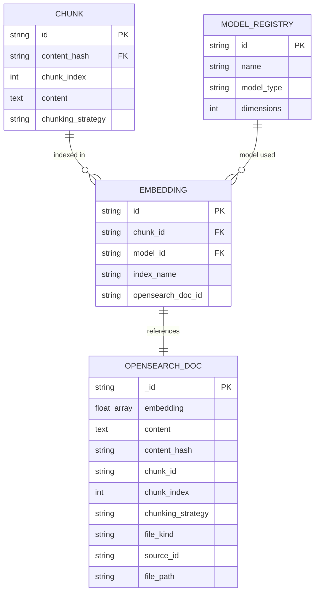

# Data Model: OpenSearch Transition

**Feature Branch**: `003-opensearch-transition`
**Date**: 2026-03-29

---

## Entity Changes

This sprint modifies two entities and introduces one new external entity (the OpenSearch document). The SQLite catalog, file, content, chunk, and task entities are **unchanged**.

### Modified: Embedding (SQLite)

Cross-reference record linking a SQLite chunk to its indexed representation in OpenSearch.

**Before** (Qdrant era):
```
EMBEDDING {
    string id PK
    string chunk_id FK          → CHUNK.id
    string model_id FK          → MODEL_REGISTRY.id
    string collection_name      -- Qdrant collection name
    string qdrant_point_id      -- Qdrant point UUID
}
```

**After** (OpenSearch era):
```
EMBEDDING {
    string id PK
    string chunk_id FK          → CHUNK.id
    string model_id FK          → MODEL_REGISTRY.id
    string index_name           -- OpenSearch index name (e.g., "kris_chunks")
    string opensearch_doc_id    -- OpenSearch document _id (UUID)
}
```

**Migration**: `ALTER TABLE RENAME COLUMN` (SQLite 3.25+). Non-destructive — existing UUID values remain valid.

---

### Modified: KrisConfig (Python dataclass)

**Before**:
```
KrisConfig {
    sources: dict[str, SourceConfig]
    models: ModelsConfig
    qdrant: QdrantConfig           -- mode, url, api_key
    data_dir: str
    cache_dir: str
    log_level: str
}

QdrantConfig {
    mode: str                      -- "embedded" | "server"
    url: str                       -- default "http://localhost:6333"
    api_key: str                   -- optional
}
```

**After**:
```
KrisConfig {
    sources: dict[str, SourceConfig]
    models: ModelsConfig
    opensearch: OpenSearchConfig    -- url, username, password, verify_certs, index_prefix
    data_dir: str
    cache_dir: str
    log_level: str
}

OpenSearchConfig {
    url: str                        -- default "https://localhost:9200"
    username: str                   -- default "admin"
    password: str                   -- default "" (reads KRIS_OPENSEARCH_PASSWORD env var)
    verify_certs: bool              -- default false (self-signed demo certs)
    index_prefix: str               -- default "kris"
}
```

**Removed**: `qdrant_path` property on `KrisConfig` (no longer applicable — OpenSearch is external).

**Added**: `opensearch_index` property returning `f"{opensearch.index_prefix}_chunks"`.

---

### New External Entity: OpenSearch Document

A single indexed chunk stored in OpenSearch. Not an SQLite entity — exists only in the OpenSearch index.

```
OpenSearchDocument {
    string _id                     -- UUID (same value as EMBEDDING.opensearch_doc_id)
    float[] embedding              -- k-NN vector (768-dim, cosine similarity)
    string content                 -- chunk text (BM25-searchable)
    string content_hash            -- FK → CONTENT.content_hash
    string chunk_id                -- FK → CHUNK.id
    int chunk_index                -- ordering within parent content
    string chunking_strategy       -- algorithm used
    string file_kind               -- text | code | markdown | config | data
    string source_id               -- FK → SOURCE.id
    string file_path               -- display path
}
```

**Index name**: `{config.opensearch.index_prefix}_chunks` (default: `kris_chunks`)

**Index settings**: single shard, zero replicas, k-NN enabled.

**Vector config**: HNSW algorithm, Lucene engine, cosine similarity, 768 dimensions (from embedding model config).

---

## Entity Relationship Diagram (Changes Only)



Note: OPENSEARCH_DOC is an external entity in the OpenSearch index, not an SQLite table. The `EMBEDDING.opensearch_doc_id` field references `OPENSEARCH_DOC._id`.

---

## Unchanged Entities

The following entities are NOT modified by this sprint:

- **SOURCE** — scan configuration, no search backend dependency
- **SCAN_SCHEDULE** — schedule definitions
- **FILE** — file catalog metadata
- **CONTENT** — content-addressed records
- **CHUNK** — chunk records (source of truth in SQLite; text also copied to OpenSearch for search)
- **TASK** — processing task queue
- **MODEL_REGISTRY** — model definitions
- **FILE_SUMMARY** — summaries
- **CHUNK_SUMMARY** — chunk summaries
- **FILE_TAG** — tags
- **CONTENT_RELATION** — content relationships

---

## Config TOML Schema Change

**Before** (`config.toml`):
```toml
[qdrant]
mode = "embedded"            # "embedded" or "server"
# url = "http://localhost:6333"
# api_key = ""
```

**After** (`config.toml`):
```toml
[opensearch]
url = "https://localhost:9200"
username = "admin"
password = ""                # or set KRIS_OPENSEARCH_PASSWORD env var
verify_certs = false         # true for production with real certificates
index_prefix = "kris"        # indices named: kris_chunks, etc.
```
